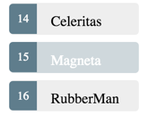

继上节案例 ，添加功能  显示英雄列表功能

------
## 创建模拟数据
------

在`src /app /`文件夹中创建一个名为mock-heroes.ts的文件。 如下：

```typescript
// src/app/mock-heroes.ts
import { Hero } from './hero';

export const HEROES: Hero[] = [
  { id: 11, name: 'Mr. Nice' },
  { id: 12, name: 'Narco' },
  { id: 13, name: 'Bombasto' },
  { id: 14, name: 'Celeritas' },
  { id: 15, name: 'Magneta' },
  { id: 16, name: 'RubberMan' },
  { id: 17, name: 'Dynama' },
  { id: 18, name: 'Dr IQ' },
  { id: 19, name: 'Magma' },
  { id: 20, name: 'Tornado' }
];
```
## 显示英雄列表
------

在 `HeroesComponent` 类文件中导入模拟的数据：

```typescript
import {HEROES} from '../mock-heroes'
```

定义一个组件属性 `heroes`  

```typescript
export class HeroesComponent implements OnInit {
	....
	heroes = HEROES;	
	....
}
```

### 使用 *ngFor 迭代英雄列表
------

`HeroesComponent` 模板中作如下修改：

- 添加 <h2> 标签
- 添加HTML无序列表（<ul>）
- 在 <ul> 中插入 <li> 标签来展示英雄属性
- 为列表添加样式

  修改如下：

```html
// heroes.component.html

<h2>My Heroes</h2>
<ul class="heroes">
  <li>
    <span class="badge">{{hero.id}}</span> {{hero.name}}
  </li>
</ul>
```

将<li> 更改为：

```typescript
<li *ngFor="let hero of heroes">
```

[*ngFor](https://angular.io/guide/template-syntax#ngFor) 是 Angular's *repeater*  指令，主要用来遍历列表

> 不要忘记 ngFor 前面的 （*）， 它也是语法的一部分。


### 为列表添加样式

------

希望当用户将鼠标悬停在列表中并从列表中选择英雄时，应该以可视方式响应。

添加样式的方式：

1. styles.css 中添加样式，这个文件一般用在为应用程序设置基本样式
2. 可能习惯为组件添加私有样式，并将组件、HTML文件、CSS文件保存在一个位置。本例中 'heroes.component.css' 添加样式。这种方式的好处除了就近维护外同时也有利于在其它地方进行组件的复用。

通过 [@Component.styles](https://angular.io/api/core/Component#styles)  或  @[Component.styleUrls](https://angular.io/api/core/Component#styleUrls) 为组件添加私有样式， 前者**内联样式**后者引入**外部样式表**。 两者不能同时应用，如果同时应用后者最终生效。

当使用 `CLI`  生成 `HeroesComponent` 时，它创建一个空的  `heroes.component.css` 样式表，并在  `@Component.styleUrls`  指向了它。如下：

```typescript
// src/app/heroes/heroes.component.ts (@Component)

@Component({
  selector: 'app-heroes',
  templateUrl: './heroes.component.html',
  styleUrls: ['./heroes.component.css']
})
```

在 `heroes.component.css` 中添加私有样式：

```css
/* HeroesComponent's private CSS styles */
.selected {
  background-color: #CFD8DC !important;
  color: white;
}
.heroes {
  margin: 0 0 2em 0;
  list-style-type: none;
  padding: 0;
  width: 15em;
}
.heroes li {
  cursor: pointer;
  position: relative;
  left: 0;
  background-color: #EEE;
  margin: .5em;
  padding: .3em 0;
  height: 1.6em;
  border-radius: 4px;
}
.heroes li.selected:hover {
  background-color: #BBD8DC !important;
  color: white;
}
.heroes li:hover {
  color: #607D8B;
  background-color: #DDD;
  left: .1em;
}
.heroes .text {
  position: relative;
  top: -3px;
}
.heroes .badge {
  display: inline-block;
  font-size: small;
  color: white;
  padding: 0.8em 0.7em 0 0.7em;
  background-color: #607D8B;
  line-height: 1em;
  position: relative;
  left: -1px;
  top: -4px;
  height: 1.8em;
  margin-right: .8em;
  border-radius: 4px 0 0 4px;
}
```

>  **@Component元数据中标识的样式和样式表的范围限定为该特定组件， heroes.component.css 样式只应用在 `HeroesComponent`  并且不会影响内部以及外部的其它组件**


## 主/明细

------

如果希望当用户在主列表中点击一个英雄，组件在页面底部展示英雄的详细信息。

针对上面的提的要求，这里你需做两件事：

1. 监听英雄项 click 事件
2. 更新英雄的详细信息。

### 添加 click 事件绑定

------

在 <li> 增加一个click 事件，修改 `heroes.component.html` 如下：

```html
<li *ngFor="let hero of heroes" (click)="onSelect(hero)">
```

` (click)` 为Angular's绑定语法，详细 可以点击这里查看 [event binding](https://angular.io/guide/template-syntax#event-binding) .

`(click)` 作用是：告诉Angular's 需要监听列表项的 `click` 事件，当用户点击 <li> 元素时， Angular  执行 `onSelect(hero)` 表达式.

### 添加点击事件处理程序

------

将组件的 `hero` 属性重命名为  `selectedHero`  ，但不要为它赋值；因为应用程序启动时没有选定的英雄。

如下添加 `onSelect()` 方法，主要把页面中点击的英雄对象赋值给组件的 `selectedHero` 属性。

```typescript
// src/app/heroes/heroes.component.ts (onSelect)

import { Component, OnInit } from '@angular/core';
import {Hero} from '../hero';
import {HEROES} from '../heroes';

console.log(HEROES);
@Component({
  selector: 'app-heroes',
  templateUrl: './heroes.component.html',
  styleUrls: ['./heroes.component.css']
})
export class HeroesComponent implements OnInit {
  heroes = HEROES;
  selectedHero: Hero;
  onSelect(hero) {
    this.selectedHero = hero;
  }
  constructor() { }
  ngOnInit() {
  }
}

```

### 更新详情模板

------

因为前面把 `hero` 属性重命名为 `selectedHero`，更新模板如下：

```html
// heroes.component.html (selected hero details)

<h2>{{selectedHero.name | uppercase}} Details</h2>
<div><span>id: </span>{{selectedHero.id}}</div>
<div>
  <label>name:
    <input [(ngModel)]="selectedHero.name" placeholder="name">
  </label>
</div>

```

### 使用 `*ngif`  隐藏空白的详情信息

------

上述修改后，刷新浏览器后，应用程序就崩溃了。

打开浏览器开发者工具，在控制台中查看到如下错误消息：

```
HeroesComponent.html:3 ERROR TypeError: Cannot read property 'name' of undefined
```

现在点击列表中的一项，可以看到应用正常。 此时 `selectedHero` 为选中的英雄。

#### 发生了什么？

当应用程序启动时，`selectedHero` 值为 `undefined`  。

模板中绑定表达式中，引用了 `selectedHero` 的属性 。在没有选择英雄的情况下，就会出现错误。

#### 修复

如果 `selectedHero` 存在，组件就显示英雄的详细信息。

这里需要使用一个<div> 包裹者详细部分，  添加Angular's `*ngIf` 指令到  <div>  并给指令设置值  `selectedHero`

```html
// src/app/heroes/heroes.component.html (*ngIf)

<div *ngIf="selectedHero">
  <h2>{{selectedHero.name | uppercase}} Details</h2>
  <div><span>id: </span>{{selectedHero.id}}</div>
  <div>
    <label>name:
      <input [(ngModel)]="selectedHero.name" placeholder="name">
    </label>
  </div>
</div>
```

刷新浏览器后，列表名字正常显示。 详细信息区域是空白。 单击一个英雄，它的详细信息就会出现。

**为什么会这样？**

当 `selectedHero` 是 undefined时，ngIf 从DOM中移除详细信息。就不要担心 `selectedHero`  绑定的问题；

当用户选择英雄时，`selectedHero` 包含一个值， ngIf 会把详细信息添加到DOM中。

### 添加选中英雄的样式

------

当所有<li>元素看起来都一样时，很难识别列表中所选的英雄。

如果用户点击 `Magneta` , 英雄应该渲染一个背景颜色，像这样：



那么只需要在用户点击时，添加 `.selected` 类添加到 `li` 上。

使用 Angular [class binding](https://angular.io/guide/template-syntax#class-binding)  容易根据条件去添加和移除样式。只需添加 `[class.some-css-class]="some-condition"` 到想要设置样式的元素上。

添加以下 [class.selected] 。绑定到`HeroesComponent`模板中的<li>:

```javascript
// heroes.component.html (toggle the 'selected' CSS class)
[class.selected]="hero === selectedHero"
```

当前行`hero`与`selectedHero`相同时，Angular  添加 .selected  类,  当两个不同时，Angular会移除这个类。

完成的 <li> 看起来像下面：

```html
//heroes.component.html

<li *ngFor="let hero of heroes"
  [class.selected]="hero === selectedHero"
  (click)="onSelect(hero)">
  <span class="badge">{{hero.id}}</span> {{hero.name}}
</li>
```

## 最终代码 

------

```typescript
// src/app/heroes/heroes.component.ts

import { Component, OnInit } from '@angular/core';
import { Hero } from '../hero';
import { HEROES } from '../mock-heroes';
 
@Component({
  selector: 'app-heroes',
  templateUrl: './heroes.component.html',
  styleUrls: ['./heroes.component.css']
})
 
export class HeroesComponent implements OnInit {
 
  heroes = HEROES;
  selectedHero: Hero;
 
  constructor() { }
 
  ngOnInit() {
  }
 
  onSelect(hero: Hero): void {
    this.selectedHero = hero;
  }
}
```

```html
// src/app/heroes/heroes.component.html

<h2>My Heroes</h2>
<ul class="heroes">
  <li *ngFor="let hero of heroes"
    [class.selected]="hero === selectedHero"
    (click)="onSelect(hero)">
    <span class="badge">{{hero.id}}</span> {{hero.name}}
  </li>
</ul>
 
<div *ngIf="selectedHero">
 
  <h2>{{selectedHero.name | uppercase}} Details</h2>
  <div><span>id: </span>{{selectedHero.id}}</div>
  <div>
    <label>name:
      <input [(ngModel)]="selectedHero.name" placeholder="name">
    </label>
  </div>
 
</div>
```

```css
// src/app/heroes/heroes.component.css

/* HeroesComponent's private CSS styles */
.selected {
  background-color: #CFD8DC !important;
  color: white;
}
.heroes {
  margin: 0 0 2em 0;
  list-style-type: none;
  padding: 0;
  width: 15em;
}
.heroes li {
  cursor: pointer;
  position: relative;
  left: 0;
  background-color: #EEE;
  margin: .5em;
  padding: .3em 0;
  height: 1.6em;
  border-radius: 4px;
}
.heroes li.selected:hover {
  background-color: #BBD8DC !important;
  color: white;
}
.heroes li:hover {
  color: #607D8B;
  background-color: #DDD;
  left: .1em;
}
.heroes .text {
  position: relative;
  top: -3px;
}
.heroes .badge {
  display: inline-block;
  font-size: small;
  color: white;
  padding: 0.8em 0.7em 0 0.7em;
  background-color: #607D8B;
  line-height: 1em;
  position: relative;
  left: -1px;
  top: -4px;
  height: 1.8em;
  margin-right: .8em;
  border-radius: 4px 0 0 4px;
}
```


## 总结

------

- 通过主/明细方式展示英雄列表
- 用户可以选择英雄并看到明细
- 使用 *ngFor 去展示列表
- 使用*ngIf 跟据条件去包含或移除HTML代码块
- 使用 class binging 切换 Class 样式表