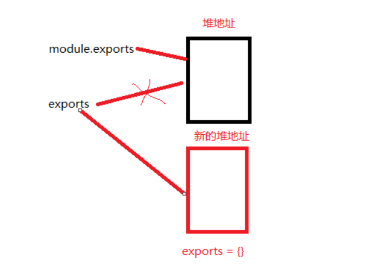
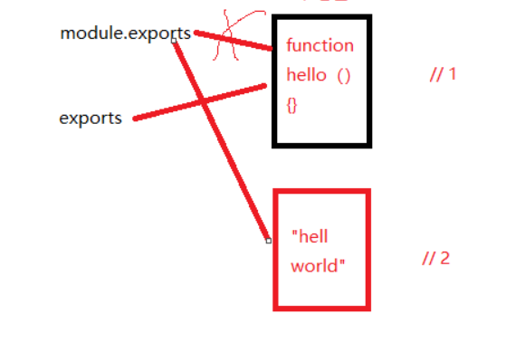

# CommonJS规范 

## 1. 概述

Node 应用由模块组成，采用 CommonJS 模块规范。

每个文件就是一个模块，有自己的作用域。在一个文件里面定义的变量、函数、类，都是私有的，对其他文件不可见。

```javascript
// example.js
let a = 1;
let add = function(x){
    return a + x;
}
```

上面代码中，变量`a`和函数`add`，是当前文件`example.js`私有的，其他文件不可见。

如果想在多个文件分享变量，必须定义为`global`对象的属性。

```javascript
global.flag = true;
```

上面代码的`flag`变量，可以被所有文件读取。当然，这样写法是不推荐的。

CommonJS规范规定，每个模块的内部`module`变量代表当前模块。这个变量是一个对象，它的`exports`属性（即`module.exports`）是对外的接口。加载某个模块，其实是加载该模块的`module.exports`属性。

```javascript
let a = 1;
let add = function(x){
    return a + x;
}
module.exports.add = add;
// 等价
exports.add = add;
```

上面代码通过`module.exports`输出函数`add`。

`require`方法用于加载模块

```javascript
var example = require('./example.js');

console.log(example.add(2)); // 3
```

**CommonJS模块的特点如下**

- 所有代码都运行在模块作用域，不会污染全局作用域。

- 模块可以多次加载，但是只会在第一次加载时运行一次，然后运行结果就被缓存了，以后再加载，就直接读取缓存结果。要想让模块再次运行，必须清除缓存。

  ```javascript
  // example.js
  console.log("example 模块已经加载");
  let a = 1;
  let add = function(x){
      return a + x;
  }
  module.exports.add = add;
  
  // repeatRequrieModule.js
  let example = require('./example');
  let example2 = require('./example');
  console.log(example.add(2));
  console.log(example2.add(2));
  console.log(example === example2); 
  
  // 输出
  example 模块已经加载
  3
  3
  true
  ```

- 模块加载的顺序，按照其在代码中出现的顺序。

------

## 2. module 对象

Node内部提供一个`Module`构建函数。所有模块都是`Module`的实例。

~~~javascript
function Module(id, parent) {
  this.id = id;
  this.exports = {};
  this.parent = parent;
  // ...
}
~~~

每个模块内部，都有一个`module`对象，代表当前模块。它有以下属性。

> **module.id** 模块的识别符，通常是带有绝对路径的模块文件名。

> **module.filename** 模块的文件名，带有绝对路径。

> **module.loaded** 返回一个布尔值，表示模块是否已经完成加载。

> **module.parent** 返回一个对象，表示调用该模块的模块。

> **module.children** 返回一个数组，表示该模块要用到的其他模块。

> **module.exports** 表示模块对外输出的值。

下面是一个示例文件，最后一行输出module变量。

```javascript
// printModuleObject.js

const fs = require('fs');
console.log(module);
```

输出结果

```javascript
Module {
  id: '.',
  exports: {},
  parent: null,
  filename: 'F:\\study\\commonJS-demo\\printModuleObject.js',
  loaded: false,
  children: [],
  paths: 
   [ 'F:\\study\\commonJS-demo\\node_modules',
     'F:\\study\\node_modules',
     'F:\\node_modules' ] }		

```
如果在命令行下调用某个模块，比如`node test.js`，那么`module.parent`就是`null`。如果是在脚本之中调用，比如`require('./test.js')`，那么`module.parent`就是调用它的模块。利用这一点，可以判断当前模块是否为入口脚本。

```
if (!module.parent) {
    // ran with `node test.js`
	
} else {
    // used with `require('./test.js')`
}
```

------

#### 2 .1 module.exports 属性

`module.exports`属性表示当前模块对外输出的接口，其他文件加载该模块，实际上就是读取`module.exports`变量。

#### 2.2 exports变量

为了方便，Node为每个模块提供一个exports变量，指向module.exports。这等同在每个模块头部，有一行这样的命令。

```javascript
let exports = module.exports;
```

造成的结果是，在对外输出模块接口时，可以向exports对象添加方法。

```javascript
exports.area = function (r) {
  return Math.PI * r * r;
};

exports.circumference = function (r) {
  return 2 * Math.PI * r;
};
```

注意，不能直接将exports变量指向一个值，因为这样等于切断了`exports`与`module.exports`的联系。

**示例1** 



```javascript
exports = {add:function(){}}
```

上面这样的写法是无效的，因为`exports`不再指向`module.exports`了。

**示例2**

下面的写法也是无效的。

```javascript
exports.hello = function() { 	// 1
  return 'hello';
};

module.exports = 'Hello world'; // 2
```

上面代码中，`hello`函数是无法对外输出的，因为`module.exports`被重新赋值了。



**这意味着，如果一个模块的对外接口，就是一个单一的值，不能使用`exports`输出，只能使用`module.exports`输出。**

## 3. require 命令

------

#### 3.1 基本用法

Node使用CommonJS模块规范，内置的`require`命令用于加载模块文件。

`require`命令的基本功能是，读入并执行一个JavaScript文件，然后返回该模块的exports对象。如果没有发现指定模块，会报错。

```javascript
let a = 1;
let add = function(x){
    return a + x;
}
module.exports.add = add;
```

运行下面的命令，可以输除**module.exports**对象

```javascript
var example  = require('./example');
console.log(example);
// example 模块已经加载
// { add: [Function: add] }
```

如果模块输出的是一个函数,可以这么写

```javascript
// example2.js
module.exports = function (name, age) {
    this.name = name;
    this.age = age;
}
// require-01.js

let Example = require('./example2');
let person = new Example('张三',20);
console.log(person.name); // 张三
console.log(person.age);  // 20
```

#### 3.2 加载规则

`require`命令用于加载文件，后缀名默认为`.js`。

```javascript
var foo = require('foo');
//  等同于
var foo = require('foo.js');
```

本地测试项目目录目录为： F:\study\commonJS-demo 

根据参数的不同格式，`require`命令去不同路径寻找模块文件。

例如在 F:\study\commonJS-demo\require-01.js 中

1. 如果参数字符串以“/”开头，则表示加载的是一个位于绝对路径的模块文件。比如，`require('/example2.js')`将加载`f:/example2.js`。

2. 如果参数字符串以“./”开头，则表示加载的是一个位于相对路径（跟当前执行脚本的位置相比）的模块文件。比如，`require('./example2')`将加载当前脚本同一目录的  `F:\study\commonJS-demo\example2.js`。

3. 如果参数字符串不以“./“或”/“开头，则表示加载的是一个默认提供的核心模块（位于Node的系统安装目录中），或者一个位于各级node_modules目录的已安装模块（全局安装或局部安装）。

   举例来说，脚本` F:/study/commonJS-demo/require-01.js`执行了`require('example2.js')`命令，Node会依次搜索以下文件。

   > 'F:\\study\\commonJS-demo\\node_modules',
   > 'F:\\study\\node_modules',
   > 'F:\\node_modules' 

4. 如果指定的模块文件没有发现，Node会尝试为文件名添加`.js`、`.json`、`.node`后，再去搜索。`.js`件会以文本格式的JavaScript脚本文件解析，`.json`文件会以JSON格式的文本文件解析，`.node`文件会以编译后的二进制文件解析。

5. 如果想得到`require`命令加载的确切文件名(模块中完整的文件名指的是路径)，使用`require.resolve()`方法。

   ```javascript
   // 执行
   require.resolve('./example2')
   // 输除
   F:\study\commonJS-demo\example2.js
   ```

#### 3.3 目录的加载规则

​	require 通过分析文件扩展名之后，可能没有找到对应文件，但却得到一个目录，这在引入自定义模块和逐个模块路径进行查找时经常会出现，此时Node会将目录当做一个包来处理。

​	首选当前目录下查找 package.json  然后加载main字段指定的入口文件。  如果package.json 不存在或  main指定文件名错误， Node 会将index作为默认文件名，然后依次查找 index.js、index.json、index.node.

​	如果目录中没有定位找到任何文件，则自定义模块进入下一个模块路径进行查找。 如果模块路径数组遍历完毕，依然没有查找到目标文件，则会抛出查找失败的异常。

#### 3.4 模块的缓存

Node 对引入的模块都会进行缓存，以减少二次引入时的开销。类似浏览器缓存JS脚本。不同的地方在于，浏览器仅仅缓存文件，而Node缓存的是编译和执行后的对象。

**示例**

```javascript

// example.js
console.log("example 模块已经加载");

// test.js
require('./example');
require('./example').message = "hello";
console.log(require('./example').message);

// 运行输出结果
example 模块已经加载
hello
```

`require` 方法对相同模块的二次加载都一律采用缓存优先的方式，这是第一优先级。不同之处在于核心模块的缓存检测先于文件模块的缓存检查.(自定义模块的时不要与核心模块同名)

所有缓存的模块保存在`require.cache`之中

**先来打印缓存对象看看**

```
{ 'F:\\study\\commonJS-demo\\test.js': 模块对象,
  'F:\\study\\commonJS-demo\\example.js': 模块对象
}

```
返回对象key 为模块的完整路径，所以如果要手动删除自定义模块缓存需获取该模块完整路径。

如果想删除模块的缓存，可以像下面这样写。

```javascript
// 删除指定模块的缓存 
delete require.cache[moduleName];
// 对于自定义模块
require('./example');  // 引入模块方式
delete require.cache[require.resolve('./example')];	 //删除方式

// 删除所有模块的缓存
Object.keys(require.cache).forEach(function(key) {
  delete require.cache[key];
})
```